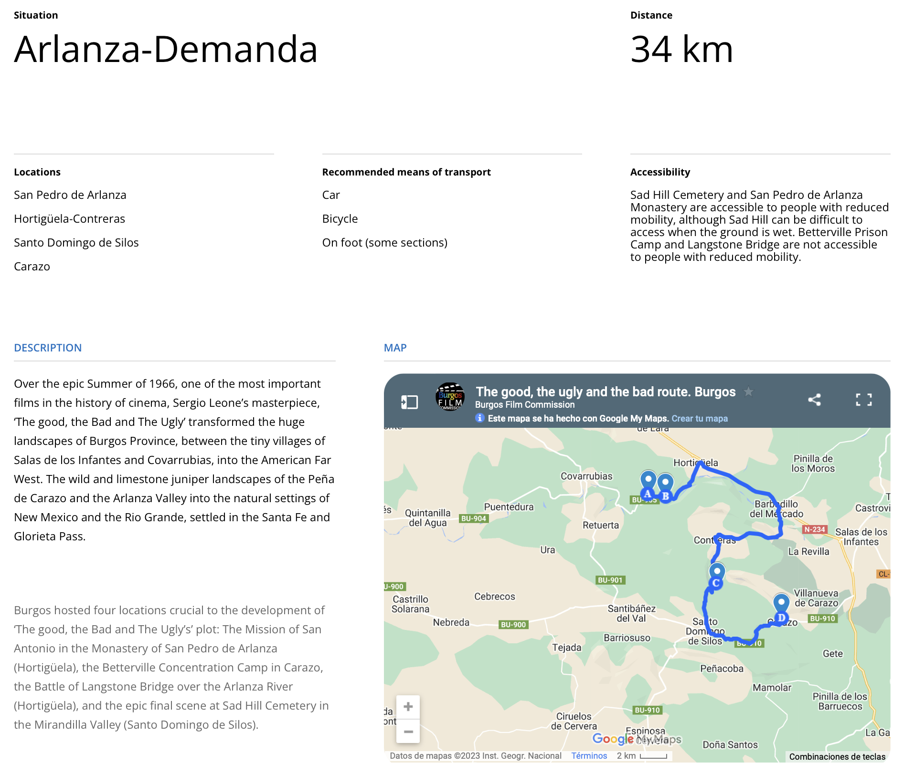

# Localizaciones de cine - España

https://www.filmingalmeria.es/Servicios/Informacion/Informacion.nsf/2DB9A8691D1FC44CC1257E0D003E2384/%24file/guia_cine.pdf

https://www.picachico.com/los-escenarios-de-cine-almeria/

_Desierto de Tabernas_

El único desierto de Europa donde se han rodado más de 300 películas; de hecho, en las décadas de los 60 y los 70 esta zona se conocía como *El Hollywood europeo*. Entre ellas, la ganadora de siete Oscars *Lawrence de Arabia*, *Cleopatra* (con Elizabeth Taylor) o *Indiana Jones y la Última Cruzada* (también rodada en la Playa de los Escullos).
No podemos olvidar del oasys Parque temático y Fort Bravo donde puedes ver decorados de muchas películas de western, se trata de un museo del cine.

_La Alcazaba de Almería_

La Alcazaba almeriense es la más grande de las ciudadelas árabes que se construyeron en España. Además de su espectacularidad como monumento, en ella se han rodado dos grandes superproducciones: *Indiana Jones y la última cruzada*, de Steven Spielberg, con Harrison Ford y Sean Connery, y *Nunca digas nunca jamás*, con Kim Basinger y también con Connery.

_Parque Natural del Cabo de Gata_

El Parque Natural de Cabo de Gata además de una reserva natural única es un popular escenario de cine en el que se filman multitud de rodajes cada año. Uno de los más famosos es la sexta temporada de *Juego de Tronos* (también rodada en los Faros de Mesa Roldán). De hecho, se han creado productos turísticos que puedes disfrutar como las rutas BTT recorriendo las localizaciones de rodaje de la serie en Cabo de Gata.

_El Chorrillo_

Este paraje ha sido el plató natural de la película *Exodus,* casi el 70% de la película se grabó aquí. Los decorados se pueden ver hoy día y pueden ser visitados, por lo que puedes darte un paseo y sentirte dentro de la película. Además, también ha sido lugar de rodaje de *Juego de Tronos* y *Assassin’s Creed*, entre otras.
Te proponemos una escapada roadtrip para conocer estos escenarios de cine en Almería, alojándote en las Casas Rurales Picachico, donde tomar como base para las excursiones a los diferentes emplazamientos. Seguro que será una experiencia de película. Con nuestras instalaciones podrás descansar, relajarte y beneficiarte de descuentos por larga estancia.
El tiempo ideal es una semana, para poder viajar a los diferentes lugares, poder probar la gastronomía almeriense, disfrutar de los paisajes y cómo no del mejor descanso y el relax en nuestras casas rurales con jacuzzi en Almería. 

**_Ruta de El bueno, el feo y el malo_**

https://www.turismocastillayleon.com/es/arte-cultura-patrimonio/rutas-culturales/bueno-feo-malo

Esta propuesta de ruta no sigue el orden cronológico de la película pero es el trazado más lógico para visitar las localizaciones.
Partimos de Salas de los Infantes en dirección Burgos. En este primer tramo discurrimos aguas abajo del río Arlanza por su margen derecha y vemos a la izquierda la cara norte de la Peña de Carazo y la Peña de Barbadillo. En Hortigüela, tomamos dirección Covarrubias; aquí el Valle de Arlanza se va estrechando en un preciosos desfiladero, adentrándonos en el Espacio Natural Sabinares del Arlanza.
Llegamos a la primera localización de la ruta:** La Batalla del Puente Langstone;** hoy casi irreconocible y cubierta por mucha vegetación, pero con las trincheras aún visibles si subimos a la parte más elevada de la ladera.
Seguimos y un kilómetro más adelante llegamos a las ruinas del histórico monasterio de San Pedro de Arlanza "cuna de Castilla" donde se rodaron los interiores de la **Misión de San Antonio.**

Continuamos el camino dirección Santo Domingo de Silos, donde llegaremos, una vez pasado Contreras, al Valle de Mirandilla donde se encuentra el set del **Cementerio de Sad Hill;** ascendiendo la ladera de 1.280 m de altitud para contemplar el mismo en toda su magnitud enclavado en uno de los más bellos paisajes de la Sierra de la Demanda a los pies de la Peña de Carazo.
La ruta continúa por la carretera que discurre encajonada en el impresionante y bellísimo desfiladero de calizas que forma aguas arriba el río Mataviejas, donde en un altozano conocido como Majada de las Merinas se rodó la escena del **Campo de Concentración de Betterville,** última localización de esta ruta; desde donde regresaremos al punto de partida en Salas de los Infantes

**_Ruta de El bueno, el feo y el malo_**

https://burgosfilmcommission.org/en/the-good-the-bad-the-ugly-route/

**_Ruta cine Burgos_**

**_Localizaciones_**

https://www.imdb.com/title/tt0060196/locations/?ref_=tt_dt_loc

https://www.imdb.com/title/tt0059578/locations/?ref_=tt_dt_loc

https://www.imdb.com/title/tt0058461/locations/?ref_=tt_dt_loc

**_Por un puñado de dólares (1964)_**

Cabo de Gata, Almería, Andalucía, España

Cinecittà Studios, Cinecittà, Roma, Lacio, Italia
(Studio)
Almería, Andalucía, España

Los Albaricoques, Cabo de Gata, Almería, Andalucía, España
(San Miguel mexican town)
Cortijo El Sotillo, Almería, Andalucía, España
(San Miguel mexican town opening scene)
Tabernas, Almería, Andalucía, España

Hoyo de Manzanares, Madrid, España
(San Miguel - main street)
Aldea del Fresno, Madrid, España
(River scene)
Desierto de Tabernas, Almería, Andalucía, España

Casa de Campo, Madrid, España
(Rojo house)
Colmenar Viejo, Madrid, España

Polopos, Almería, Andalucía, España

España

Italia
(Elios Studios)

**_La muerte tenía un precio (1965)_**

Mini Hollywood, Tabernas, Almería, Andalucía, España
(City of El Paso, bank scenes)
Almería Railway Station, Almería, Andalucía, España
(train sequence)
Cinecittà Studios, Cinecittà, Roma, Lacio, Italia
(interiors and Town of Santa Cruz)
La Calahorra, Granada, Andalucía, España
(Tucumcari train station)
Almería, Andalucía, España
(Yuma prison and El Paso Tribune interior scenes)
Colmenar Viejo, Madrid, España
(Town of White Rocks)
Desierto de Tabernas, Almería, Andalucía, España

Granada, Andalucía, España

Guadix, Granada, Andalucía, España
(train sequence)
Hoyo de Manzanares, Madrid, España
(Town of Tucumcari)
Tabernas, Almería, Andalucía, España
(town, set)
Cabo de Gata, Almería, Andalucía, España

Finca El Romeral, San José, Almería, Andalucía, España
(Alamo Gordo prison)
Los Albaricoques, Cabo de Gata, Almería, Andalucía, España
(Town of Aguas Calientes, final scene)
San José, Almería, Andalucía, España

Cortijo del Fraile, Níjar, Almería, Andalucía, España
(El Indio's gang's hideout, Yuma prison's roof)
Church of Santa Maria, Turrillas, Almería, Andalucía, España
(church)
Turrillas, Almería, Andalucía, España
(church)
Polopos, Almería, Andalucía, España
(Mexican town)
Rodalquilar, Almería, Andalucía, España
(El Indio's gang's hideout)

**_El bueno, el feo y el malo (1966)_**

Carazo, Burgos, Castilla y León, España
(Betterville concentration camp)
Cabo de Gata, Almería, Andalucía, España
(monastery/long desert walk scene)
Covarrubias, Burgos, Castilla y León, España
(battle at Langstone Bridge)
Santo Domingo de Silos, Burgos, Castilla y León, España
(Sad Hill Cemetery exterior scene finale)
Burgos, Castilla y León, España
(civil war battle)
Tabernas, Almería, Andalucía, España
(night scene in Santa Anna / streets of Santa Fe)
Colmenar Viejo, Madrid, España
(shelled town of Peralta)
Cortijo del Fraile, Níjar, Almería, Andalucía, España
(Monastery of San Antonio Mission exterior scene)
La Calahorra, Granada, Andalucía, España
(railroad station)
Roma, Lacio, Italia

Arlanza River, Burgos, Castilla y León, España
(Langstone Bridge battle)
Mini Hollywood, Tabernas, Almería, Andalucía, España
(Cities of Valverde and Santa Ana and other town scenes)
Elios Film, Roma, Lacio, Italia
(Studio)
Monasterio de San Pedro de Arlanza, Hortigüela, Burgos, Castilla y León, España
(military hospital)
La Pedriza, Manzanares el Real, Madrid, España

Andalucía, España

Almería, Andalucía, España
(town scenes)
Desierto de Tabernas, Almería, Andalucía, España

Estación de Calahorra, Guadix, Granada, Andalucía, España
(Railroad station exterior scenes)
Granada, Andalucía, España

Rodalquilar, Almería, Andalucía, España

Cortijada del Higo Seco, Níjar, Almería, Andalucía, España
(Thomas 'Shorty' Larson hanging scene)
España

Italia

Cortijo de Doña Francisca, Níjar, Almería, Andalucía, España
(Boy and the donkey and waterwheel exterior scene)

