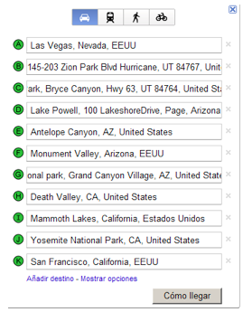
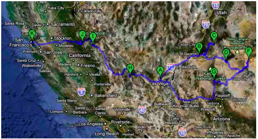

# USA - Parques Nacionales 1

Salida un sábado por la mañana, regreso un sábado para llegar aquí el domingo (16 dias 14 noches o sea 2 semanas completas y un fin de semana). 

•     Día 01 Vuelo a Las Vegas.

1.     Llegada al hotel

2.     Alquiler del coche

3.     Paseo por el strip y algún casino.

⇨     Ya que no disfrutaremos Las vegas esa noche por estar cansados y por llegar tarde y como es un sábado que es cuando es mas caro los hoteles quizás se podría pensar en dormir a las afueras en algún motel

•     Día 02 Zion National Park (3h de coche)

1.     Aprovechando el jet lag nos levantamos pronto y accedemos a este parque para realizar alguno de sus multiples trekkings

⇨     Weeping Rock, Emerald Pools, Angels Landing, The Narrows, etc

⇨     Dormir en un motel o en _http://www.cliffroselodge.com/_

•     Día 03 Zion y Bryce Canyon (2h de coche)

1.     Por la mañana realizamos alguna excursión por Zion y luego nos desplazamos a Bryce para llegar antes de la puesta de Sol

⇨     Dormir por la zona

•     Día 04 Bryce Canyon y Lago Powell (3h de coche)

1.     Con las pilas cargadas y no me refiero a nuestras piernas sino a nuestras cámaras veremos los ‘hoodoos’ y nos desplazaremos hasta el Lago Powell.

⇨     Dormir por la zona

•     Día 05 Antelope Canyon (30 mins de coche)

1.     3 tipos de excursiones el Upper, el Lower y el recorrido fotográfico

2.     Reservar con mucha antelación

3.     Según la reserva de Antelope Canyon  también podríamos hacer un tour de rafting en el Río Colorado

⇨     Dormir en Page

•     Día 06 Monument Valley  y Gran Canyon (2,5h de coche y 3,5h de coche)

1.     Visitaremos Monument Valley en un tour  con jeep de los indios navajos

2.     Por la tarde nos desplazaremos hasta la entrada Este del Gran Cañon para llegar a ver la puesta de Sol y sacar unas fotos increíbles.

⇨     Dormiremos en la entrada del parque para que no sea muy caro.

•     Día 07 Gran Canyon

1.     Merece la pena pasar todo el día y realizar alguna excursión a pie.

2.     Opción es vuelo en helicóptero

⇨     Dormiremos en el mismo sitio

•     Día 08 Ruta 66 y desierto de Nevada (8h de coche)

1.     Viajaremos un tramo de la Ruta 66 por el desierto de Nevada y llegaremos hasta la entrada de Death Valley

⇨     Dormiremos a la entrada del parque.

•     Día 09 Death Valley y Mammoth Lakes (5h de coche)

1.     Estando a 100 metros bajo el nivel del mar si las temperaturas lo permiten podemos subir a Badlands o ver Badwater o incluso Devil´s Golf Course formado por depósitos de sal.

2.     Por la tarde conduciremos por Sierra Nevada hasta llegar a Mammoth Lakes (si la temperatura en Death Valley es insoportable podemos llevar alguna excursión preparada para Mammoth Lakes)

⇨     Dormir en Mammoth Lakes

•     Día 10 Yosemite (2,5h de coche)

1.     Realizaremos la ruta por Lago Mono, Bodie Sate Park, paso Tioga y luego a mas de 3.00 metros llegamos a Yosemite. Si vamos con tiempo podemos entrar al parque y andar hasta la parte superior de Lembert Dome (3h) y disfrutar d elas vistas

⇨     Dormir dentro del parque en Curry Village  que son unas cabañas rústicas y muy básicas (muy muy básicas pero con una ubicación inmejorable)

•     Día 11 Yosemite

1.     Si se quiere subir a Half Dome la ruta es de 6-8h y hay que levantarse a las 6am

2.     Sino otra muy buena opción es conducir hasta Glacier Point uno d elos puntos panorámicos mejores del parque  y realizar ahí un trekking más suave (Panorama Trail tarda 4 ‐6h, desnivel  +200 m / ‐ 900m,  4 Mile Trail tarda 4-5h, desnivel  - 900m o Sentinel Dome & Taft Point Loop tarda 4h, desnivel  +- 200 m.)

3.     Por la tarde descansar o bien excursión en bici, rafting,…

4.     Por la noche hay excursiones para ver animales

⇨     Dormiremos en el parque

•     Día 12 Yosemite y SF (4h de coche)

1.     Por la mañana podemos ver las Sequoias gigantes en el extremo sur del parque, tomar el tranvía de subida y realizar la bajada a pie.

2.     Por la tarde nos desplazaremos a SF

⇨     Dormir en SF

•     Días 13 y 14 SF

1.     Visita d ela ciudad, alcatraz el golden Bridge, Sausalito,  Union Square , Chinatown, Fisherman's Wharf , ……

⇨     Dormir en SF

•     Día 15 Vuelta a la penosa realidad, España!

•     Día 16 en casa.

