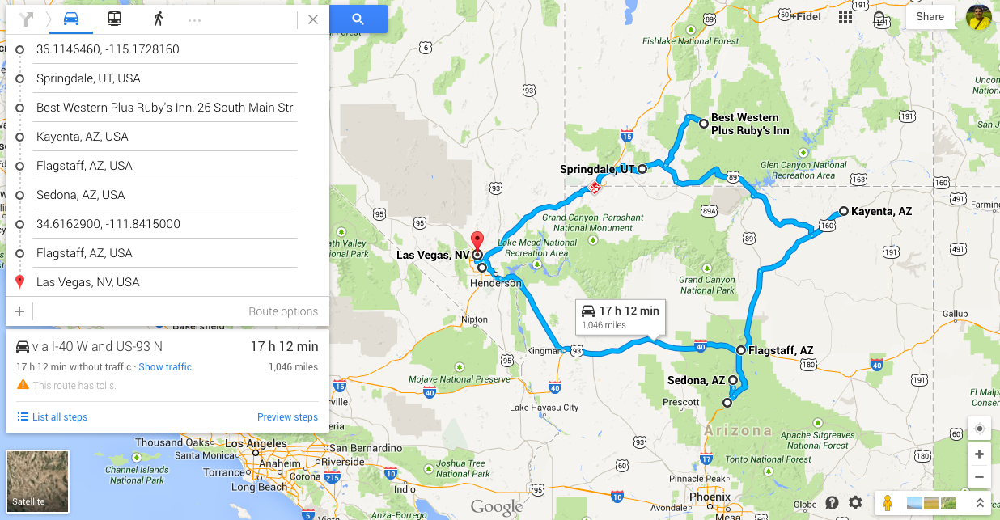

# USA - Parques Nacionales 2

29 sept. 

Dormir en Las Vegas.

30 sept.

Ir a Springdale, visitar desde el mediodia Zyon Park.

Dormir in Springdale

1 octubre

+ Zyon Park e ir a  ver la puesta de sol a Bryce Park. Dormir en Bryce Park, una posibilidad es en Rubby’s inn. Ahí durmieron Ruben pero en tienda de campaña.

2 octubre

Excursión por Bryce park, e ir a dormir a Kayenta

3 octubre

Monument Valley, excursión a caballo.

Dormir en Flagstaff u otra vez en Kayenta

4 octubre

Grand Canyon South Rim

Y otra noche en Flagstaff

5 octubre.

Visitar Sedona, Montezuma (o al revés, Montezuma (30 y está listo y Sedona, hace falta mas ratito)

Volver a dormir in Flagstaff.

6 octubre

Vuelta a Las Vegas

noche

7 octubre

San Diego

