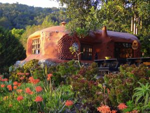
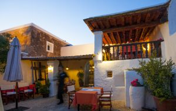
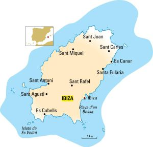
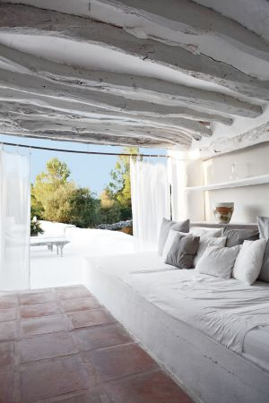

# Viaje a Ibiza

**Ibiza, eternamente joven**
**Cada primavera la isla balear se despierta para convertirse en uno de los epicentros estivales del mundo donde la juerga se alterna con el silencio de sus relajantes paisajes interiores**
* _Ibiza, descarada belleza_

* _Sabores ibicencos a pie de playa_

El dj francés David Guetta en la discoteca Pachá.
Desde que fue descubierta al mundo en los años setenta, Ibiza ha sabido reinventarse a través de las décadas, sin que su espíritu deje de relacionarse con ese cóctel de rebeldía, frescura, calor, tiempo libre y fantasías que esperan ser realizadas. Este peñasco del Mediterráneo ha seducido y seduce a guapos, triunfadores y simples mortales que cada agosto se acercan a sus costas en una peregrinación anual al santuario de la perpetua juventud y la fiesta que no cesa. Su alma bohemian chic hay que buscarla en sus inicios jipis. Entonces, la ruta pasaba por San Francisco, Katmandú, Goa, Ámsterdam o Ibiza.

La Casita Verde, en Ibiza.
Cuando los millonarios y aristócratas empezaron a anclar sus yates en la isla, para ver lo que allí se estaba cociendo, se creó una singular e irrepetible mezcla. En la pista de baile de Pachá, la primera discoteca que abrió, en 1973, se podían ver juntos, cuando todavía no se había patentado el macabro invento de la zona VIP, a la princesa Gloria von Thurn und Taxis, Roman Polanski, Nina Hagen, Ursula Andress, Niki Lauda o Carlos Sotto Mayor (la brasileña con nombre masculino, novia de Jean-Paul Belmondo) junto a locales o personajes anónimos que llegaron y se hicieron legendarios, como Jana, una nórdica que desembarcó con 17 años y vivió vendiendo los tangas que confeccionaba.
**Objeto de deseo para piratas**

Terraza del restaurante Can Berri, en Ibiza.
Desde el mar la ciudad de Ibiza tiene una estructura piramidal, coronada por un recinto amurallado sobre una colina, **Dalt Vila,** que es patrimonio mundial. Los jóvenes que vienen a pasar un fin de semana etílico a la isla ni se acercan a esta parte de la ciudad, aunque no faltan turistas que inspeccionan la catedral, el castillo o el museo arqueológico. Los barrios de**La Marina** y **Sa Penya** son un hervidero de extraños personajes, una pasarela donde el único pecado capital es el normcore (esforzarse para parecer que vas vestido normal).
Parte de la diversión consiste en ver y ser visto. Un juego que puede empezar en el desayuno, en la terraza del legendario hotel Montesol, y que mejora conforme llega la noche, cuando los viandantes despliegan su artillería pesada y sus mejores galas. Tiendas, bares y restaurantes permanecen abiertos hasta altas horas de la noche ofreciendo, como en los puertos de los libros de Conrad, saciar el hambre, hacerse un tatuaje, emborracharse o gastarse un salario en una sola noche. El alma pirata de la isla tiene su monumento en el puerto. Honra a Antoni Riquer, corsario ibicenco que, pese a la considerable desventaja de medios, logró hundir muchos buques enemigos.
**Playas escondidas y chiringuitos**
**Punta Galera,** en Sant Antoni, es una playa nudista de acantilados y aguas esmeralda. En Sant Carles, **Pou des Lleó** es una cala con casetas de pescadores. Muy cerca está la **Fonda Pou des Lleó** (_poudeslleo.com_) especializada en paellas (21 euros). **Cala Mastella** es famosa por su chiringuito **El Bigotes** (650 79 76 33). Desde hace 40 años da de comer el mismo menú: arroz y *bullit de peix* (22 euros). En la playa de **Es Calódes Multons,** en el Port de Sant Miquel, **Utopía**prepara sardinadas (13 euros) los viernes y cuscús (25 euros) los domingos.
Las alternativas para comer en la ciudad de Ibiza pueden ir desde el modesto **Bar San Juan** (Guillem de Montgrí, 8), el restaurante más viejo de la ciudad, que ofrece plato del día (desde 15 euros), hasta **El Bucanero**(_elbucaneroibiza.com_), en el puerto, con platos mediterráneos e ingredientes frescos (desde 35 euros) o **Plaza del Sol**(_plazadelsolibiza.com_), con una carta desenfadada a base de ensaladas, zumos y bocadillos (desde 25 euros).
Cenar en **Lío** (_lio.ibiza.com_) no está al alcance de todos (desde 180 euros), pero es una experiencia por su cocina, atmósfera —con vistas a Dalt Vila— y por el espectáculo, ya que se trata de un restaurante-cabaré que tras la cena muta en discoteca con piscina. **Teatro Pereyra** (_teatropereyra.com_) es una opción nocturna para los que manifiesten alergia a las macrodiscotecas. Lleva desde 1988 ofreciendo conciertos en vivo y presume de abrir todo el año y no tener zona VIP.
Si la intención es dormir en Ibiza, el hotel **Es Vivé** (_hotelesvive.com_) recuerda a los de la zona antigua de Miami, con interiores *art déco* (habitación doble desde 242 euros); mientras, el hotel **La Ventana** (_laventanaibiza.com_), en Dalt Vila, ofrece cama doble desde 100 euros.
**La ruta insomne**

Mapa de Ibiza. / JAVIER BELLOSO
Entre las muchas caras de Ibiza, la más popular es la que contempla el descanso como único delito. Además de las discotecas, la juerga puede vivirse en lo que se llama hoteles-jaleo, con fiestas a cualquier hora del día. Integrarse en una multitud danzante puede hacerse en **Pachá**(_pacha.com_); **Privilege**(_privilege.com_), la discoteca más grande del mundo; **Amnesia**(_amnesia.es_); **Space**(_spaceibiza.com_), considerada como el templo de la música electrónica, o**Es Paradis** (_esparadis.com_), que con su fiesta del agua ha derribado uno de los iconos de la noche ibicenca: la fiesta de la espuma.
El hotel **Ushuaïa** (_ushuaiabeachhotel.com_), en la playa d’en Bossa, organiza parties a partir de las cinco de la tarde en la piscina. La Tower es su parte más exclusiva, con habitaciones insonorizadas. En su página web prometen lujo, diversión, diseño, siestas, ostras y amaneceres acompañados. Leonardo DiCaprio fue el primero en estrenar su suite presidencial, I’m on the top of the world (Estoy en la cima del mundo), con dos jacuzzis, una espectacular terraza y 170 metros cuadrados.
**De espaldas al mar**

Can Domo, en Ibiza.
La Ibiza rural vive ajena al desmadre. En el interior reina el silencio, el blanco y el espíritu ecológico, y los agroturismos son los oasis donde saborear la calma. Los hay para todos los bolsillos, desde **Can Domo**(_candomo.com_), en Santa Eulària (habitación doble desde 180 euros), al lujoso **The Giri Residence**(_thegiri.com_), a las afueras del pueblo de Sant Joan (desde 395 euros). Pero para un verdadero retiro hay que ir al convento de **Carmelitas de Es Cubells**(habitación individual, 45 euros), muy cerca de playas preciosas como Ses Bosques o Cala Llentrisca. Ibiza, además de incitar al pecado, cuenta con lugares para la meditación. El pueblo de Es Cubells honra en una estatua al beato Francesc Palau, carmelita catalán y ermitaño que pasaba largas estancias en el islote de Es Vedrá, a base de huevos de gaviota y agua de una cueva. Esta roca está rodeada de leyendas y mágicas influencias y la puesta de sol tras Es Vedrá es de las más solicitadas. Para verla más de cerca, **Aquabus Ferry Boats**(_aquabusferryboats.com_) organiza excursiones de cinco horas (29 euros) que rodean el esotérico islote.
El restaurante **Can Berri Vell** (_canberrivell.es_), en Sant Agustí, debe competir con los de terraza al borde del mar. Sus armas son una casa del siglo XVII y una excelente cocina. Abre solo de noche (desde 50 euros). **La Casita Verde** (_greenheartibiza.org_) cocina los domingos (10 euros) y enseña sus instalaciones ecológicas a los visitantes.
**Compras y cerámica**
**World family Ibiza** (_worldfamilyibiza.com_) cuenta con clientas como Paula Echevarría y es una marca inspirada en la estética ‘hippy-chic’. Alok y Merel, los creadores, vendían antes sus confecciones en el Mercado de las Dalias. En **Sluiz** (_sluizibiza.com_) hay objetos bonitos e insólitos para el hogar, además de restaurante y terraza. **Dora Herbst,** pintora y artista, llegó a Ibiza en los setenta y pasó de chica ‘flower power’ a diseñadora de ropa. (Dora Herbst Boutique, Marina Botafoch, local 315, Ibiza). En **Reina&Roses** (_reinaandroses.com_), Kate Moss y Elle McPherson compran vestidos y bolsos. Hay que ver los trabajos del emblemático ceramista **Toni Marí Frígoles** y otros artesanos locales en su taller (Aragó, 16, Ibiza) y degustar la cerveza ibicenca y otras ‘delicatessen’ locales en Suprem Ibiza (_supremibiza.com_).
**Otros**

Ibiza: Aubergine, Atzaro

Calas
Discos
Kayak, SUP
Barco
Mercadillos

