# Viaje a Islandia

**50 consejos útiles para viajar a Islandia**

Si pensamos en el humo de volcanes y fumarolas, en el avance de un glaciar que se rompe lentamente en icebergs quedando a la deriva o en el pico colorido de un frailecillo asomándose a un acantilado de película es que estamos haciendo un **viaje a Islandia** con la mente. Pero hay países que tenemos que verlos con nuestros propios ojos. Ese _mundo de hielo y fuego que recrea la Tierra tal cual era_ se trata de **uno de los destinos más apasionantes y conmovedores** que se me ocurren a los que puede aspirar un viajero. Entre paisajes sublimes y la ilusión de un niño cuando se va **al volante por la famosa carretera circular R1** es fácil quedarnos con la boca abierta con todos los atractivos que tiene para **ver y hacer** este destino único. A mi vuelta de este país de sangre vikinga, tras vivir increíbles experiencias y tomar muchas notas en mi cuaderno, he preparado un listado de **50 consejos útiles para viajar a Islandia** que puedan inspirar a aquellas personas que tengan interés en visitar la isla mágica del norte.
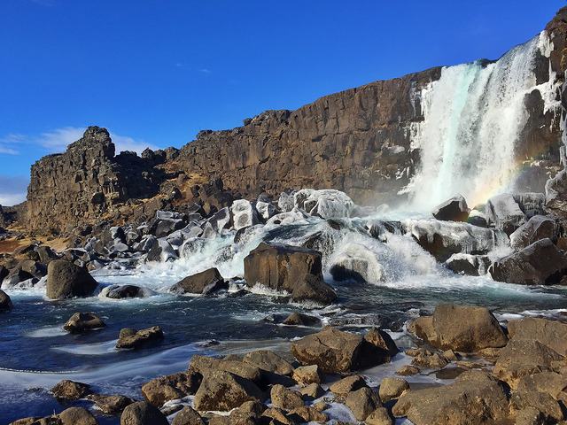

¿Es tan caro **viajar a Islandia** como nos cuentan? ¿Qué debemos llevar con nosotros? ¿Cómo moverse por el país? ¿Es fácil hacerlo por tu cuenta? ¿Qué tal son los hoteles? ¿Dónde y cuándo es mejor ver ballenas, _frailecillos_ o auroras boreales? Todas las respuestas a estas preguntas y muchas más trataré de darlas en esta **recopilación de consejos con un sentido práctico** que pueda dar luz a la hora de **preparar un viaje a Islandia** y buscar la mejor experiencia posible en el país nórdico. 
**REQUISITOS PARA VIAJAR A ISLANDIA**

– Para entrar a este país europeo territorio Schengen a los ciudadanos de la Unión Europea les basta un pasaporte o un carnet de identidad con validez mínima de 6 meses. Aunque no es UE de facto cuenta con acuerdos con estos países que permiten tratar a los ciudadanos que los visitan como si estuvieran en ella. Hay variaciones con otras nacionalidades, por lo que recomiendo echar un ojo a este _listado oficial de países que no necesitan visado para entrar a Islandia_ entre los que se encuentran los UE, Argentina, Brasil, Chile, México, Venezuela, Canadá o Estados Unidos y _países que necesitan visa o autorización para viajar a Islandia_ como, por ejemplo, Bolivia, Colombia, Cuba, Ecuador, Perú o República Dominicana.
**CÓMO LLEGAR A ISLANDIA**
– Varias compañías aéreas comunican destinos españoles con el Aeropuerto Internacional de Keflavik. Iceland Air funciona opera en temporada alta desde ciudades como Madrid o Barcelona, Vueling lo hace desde la ciudad condal y la bajo coste islandesa Wow Air, sale desde Alicante durante todo el año (a los islandeses les fascina la zona de Levante donde vienen a olvidarse del mal tiempo de su país). Esta última es una buena opción para viajar a Islandia sin importarnos el mes que sea. El coste de los vuelos a Islandia ida y vuelta tienden a estar en una horquilla aproximada de 300€ ida y vuelta, aunque si los compramos con poca antelación pueden subir y duplicarse. Otra opción es hacer escala en Londres, de donde salen varios vuelos diarios con destino Islandia.
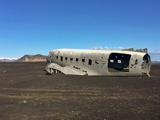

ACTUALIZACIÓN: En verano de 2016 comienzan los vuelos directos desde Madrid a Islandia con Iberia Express.
**¿CUÁNDO ES EL MEJOR MOMENTO PARA VIAJAR A ISLANDIA? ¿Y CUÁNTOS DÍAS?**
– La mejor época para viajar a Islandia y contar con un clima más benévolo es, por supuesto, el verano (junio, julio y agosto) con sus 24 horas de luz. En los meses de mayo o septiembre el tiempo no es malo y la afluencia de turistas es menor. Pero soy de la opinión de que Islandia es para todo el año. En pleno invierno, cuando el frío es evidente y se hace de noche enseguida, tenemos el reto de poder asistir en directo a un espectáculo de auroras boreales o de realizar múltiples actividades invernales. Abril no es mal mes para viajar a Islandia y nos permite hacer muchas de las cosas que se pueden llevar a cabo en verano contando con serias opciones para ver auroras, aunque sea complicado dado que anochece a eso de las diez de la noche.
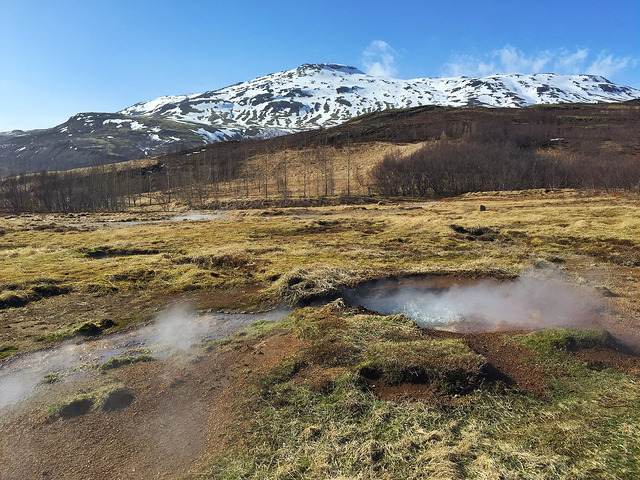

– ¿Cuántos días son necesarios para viajar a Islandia? La pregunta del millón, el tiempo que necesitamos para recorrer el país. Mínimo una semana, diez días si queremos dar la vuelta a la isla en coche alquilado (aunque sin permitirnos muchas florituras) y un par de semanas para hacerlo mucho más tranquilos. Si ya queremos hacer trekkings más o menos complejos tres semanas son perfectas. Aunque hay gente que se escapa a Islandia en puentes de 5 días para dedicarse por completo a Reykjavik, el círculo dorado y tratar de observar auroras boreales (para invierno es una muy buena idea).
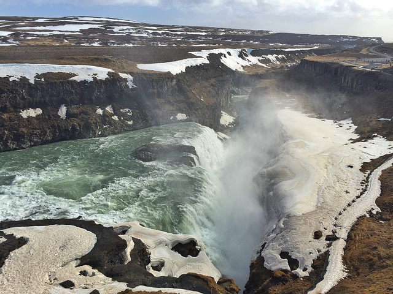

**ISLANDIA A TU AIRE**
– Hay muchas maneras de recorrer Islandia. De forma organizada en grupo, de manera completamente independiente o un mixto que funciona especialmente bien y que ofrecen compañías que operan en Islandia como _Island Tours_. Se trata de un paquete llamado “A su aire” en que en función de tus fechas y presupuesto te consiguen los vuelos, el coche de alquiler y los alojamientos, así como las actividades que te interesen, a un precio inferior a si lo haces por tu cuenta in situ. Todo de una manera coordinada, con asesoramiento total por parte del equipo que forma parte de la compañía De ese modo se puede hacer un viaje por libre en Islandia dejando cerradas algunas cuestiones importantes y así sólo preocuparse de disfrutar. Y si sucede algo (como quedarse tirado en un temporal) tienes un teléfono de emergencia 24 horas con el que ayudarte y cambiar reservas del camino si es necesario. Así fue cómo lo hice yo.
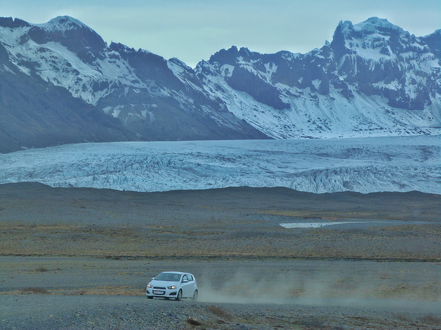

Además, desde hoy, para **los lectores de El rincón de Sele que contraten su viaje con Island Tours**podrán **elegir uno de estos tres regalos**: **Avistamiento de ballenas en Husavík o Reykjavík, barco para ver puffins en Reykjavík (entre mayo y agosto) o un safari nocturno de auroras boreales** para cuando llegue el invierno. En el momento de solicitar información para la reserva sólo hay que comentar que venís a través “El rincón de Sele” y cuál es la excursión que escogéis.
Si no estáis decididos a contratar un paquete de este tipo puede resultar útil comparar precios de vehículos de alquiler en Islandia con hasta un 15% de descuento:

**EN COCHE POR LA CARRETERA CIRCULAR**
– Una buena manera de recorrer Islandia por nuestra cuenta es hacerlo en vehículo de alquiler utilizando la carretera circular que rodea completamente la isla, la Ring Road o Ruta número 1. Podemos hacerlo siguiendo las agujas del reloj o al revés, en función de lo que más nos pueda apetecer (desconozco la razón pero un mayor porcentaje de turistas dan la vuelta a la isla en el sentido contrario a las agujas del reloj).
– La carretera circular número 1 es asfaltada en su mayor parte, salvo en unos pequeños tramos pequeños situados en los fiordos orientales, en ningún modo complicados. Es mayoritariamente de dos carriles bien diferenciados, uno por cada sentido. Lo que viene siendo una carretera secundaria en cualquier país. Por el momento no existen las autopistas ni autovías en Islandia. Está bien mantenida, sin apenas baches o badenes molestos.
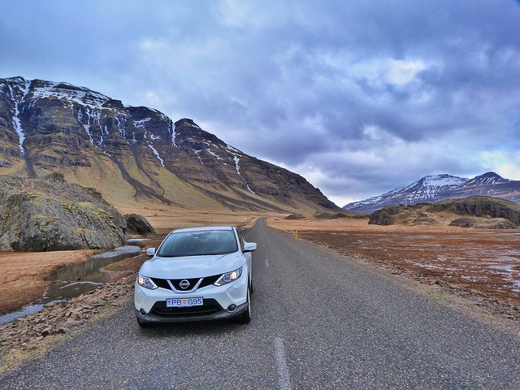

– La máxima velocidad permitida en Islandia es 90 kilómetros por hora fuera de ciudad en carreteras asfaltadas como, por ejemplo, la Ring Road o carretera circular. Dentro de poblado está prohibido pasarse de los 50 km/h. A pesar de ser carreteras absolutamente rectas donde puedes tardar una hora en ver otro vehículo conviene no sobrepasar la velocidad marcada puesto que hay radares tanto fijos como móviles y las multas de tráfico en Islandia son muy cuantiosas. Estamos hablando de más de 600€ por ir 20 km por encima del límite.
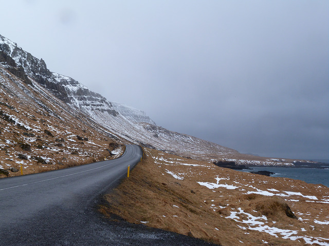

Los coches de policía cuentan con cámaras y radares móviles y en cuanto te pasas de la velocidad permitida te paran. Van con lectores de tarjeta de crédito para que pagues in situ y no te escapes sin un buen sablazo islandés.
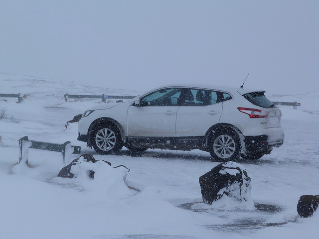

– Antes de preparar una ruta por carretera conviene mirar la web islandesa de tráfico _www.vegagerdin.is/english_ en la que se puede consultar las condiciones de la vía actualizadas al minuto. Incluso se pueden ver los distintos tramos por webcam. Especialmente útil cuando hay temporales de nieve en que se cortan las carreteras de repente. Hay distintos colores que definen la situación de la vía, siendo el verde el “Fácil de pasar” y el rojo el “No se puede pasar por aquí”. Entre medias hay matices como el blanco (nieve en el asfalto), el amarillo (placas de hielo dispersas), azul (escurridiza), el rosa (difícil conducción) o el negro (pésimas condiciones de la vía).
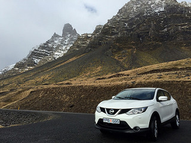

Conviene tener muy en cuenta estas indicaciones dado que cuando hay temporal en Islandia la visibilidad puede ser mínima o se corre serio peligro de quedarnos atrapados en la nieve. Normalmente cuando esto sucede sacan grandes máquinas quitanieves por la mañana, aunque no a primerísima hora. Podemos despertarnos con las carreteras cortadas y tenerlas habilitadas en menos de una hora. Si tenemos algún problema en carretera el 112 es el teléfono islandés de emergencias.
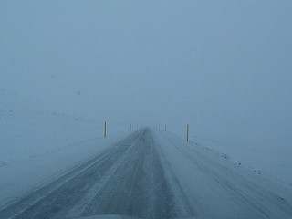

– Cuando vayamos en el coche podemos encontrar largos tramos de carretera sin cruzarnos con un solo vehículo. Y sin una sola gasolinera. Conviene llevar con nosotros un buen mapa de Islandia que refleje las gasolineras (aunque si llevamos GPS mejor que mejor) y no apurar el combustible en demasía para evitar contratiempos que nos mantengan parados en el arcén durante horas.
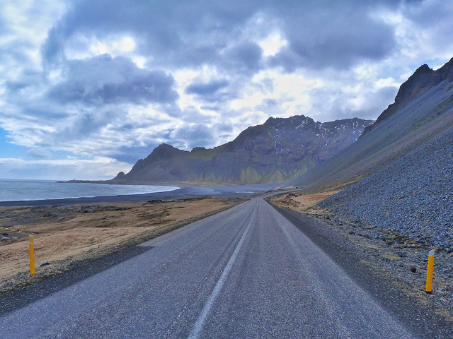

– El 100% de las gasolineras islandesas son autoservicio. Y, aunque algunas ofrezcan según casos la posibilidad de pagar dentro al dependiente de turno, lo normal es que paguemos con la tarjeta de crédito en el propio surtidor antes de rellenar el coche de gasolina o gasoil. La mecánica de echar gasolina es siempre la misma y, aunque nosotros lo nos lo guisamos y lo pagamos sin necesidad de hablar con nadie, es fácil guiarse por la intuición a la hora que llevar a cabo todo el proceso (casi todas las gasolineras ofrecen información en islandés y casi siempre en inglés. Incluso muchas N1 en castellano). Los pasos a dar son los siguientes:
*En los surtidores debemos introducir en primer lugar nuestra tarjeta de crédito, antes de quitar la manguera. Nos pedirá la cantidad máxima en coronas islandesas que deseamos gastar (no nos hará elegir si diésel o gasolina). Si queremos llenar el coche y hemos puesto 15.000 coronas, por ejemplo, pero lo terminamos completando con 12.000 sólo nos cargarán en la tarjeta lo que gastemos. Ni una corona más. Después echamos la gasolina o gasoil. Colgamos de nuevo la manguera y fin de la operación. Sencillo, ¿verdad? No tiene ninguna historia salvo lo de la cantidad máxima.*

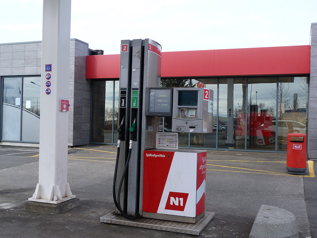

– Cuando en un cartel de carretera el número de la misma viene antecedido por una F significa que es sólo accesible para 4×4 y que si nos sucediera algo en ruta el seguro no se responsabilizaría de los daños al vehículo. Y, por supuesto, de los nuestros.
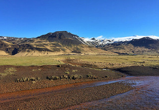

– Los islandeses son, por regla general, muy hospitalarios con los extranjeros que visitan su país. Su amabilidad está fuera de toda duda y siempre ofrecen su ayuda cuando nos encontramos en algún aprieto como, por ejemplo, cuando nos quedamos tirados en la nieve con el coche. En ellos siempre tenemos “una pala amiga” cada vez que hay nieve y colaboración desinteresada cada vez que podamos necesitar algo.
** SI NO TE GUSTA EL TIEMPO EN ISLANDIA… ¡ESPERA CINCO MINUTOS!**
– Si hay algo que puede resultar un suplicio en Islandia no es el frío sino el viento. Podemos tener temperaturas de 0º como en cualquier invierno europeo pero la sensación térmica ser de -15º. Las temperaturas islandesas no son tan extremas como podamos imaginar, incluso en invierno, pero sí lo es el viento, que es el que puede jugarnos malas pasadas.
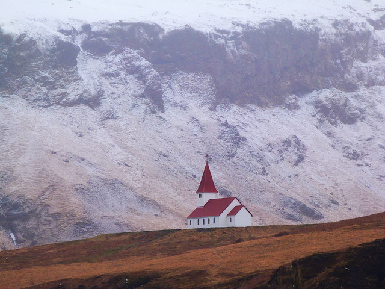

– En Islandia el clima es muy cambiante y podemos pasar de la noche a la mañana de tener un día soleado a caer una nevada de campeonato. Existe un dicho popular que nos cuenta que “si no nos gusta el tiempo, esperemos cinco minutos”. Y esta es una gran verdad que debemos tener en cuenta. Herramientas como la web del servicio de meteorología islandés (_en.vedur.is_) es muy práctica e informa de los pronósticos del tiempo con muchísima precisión.
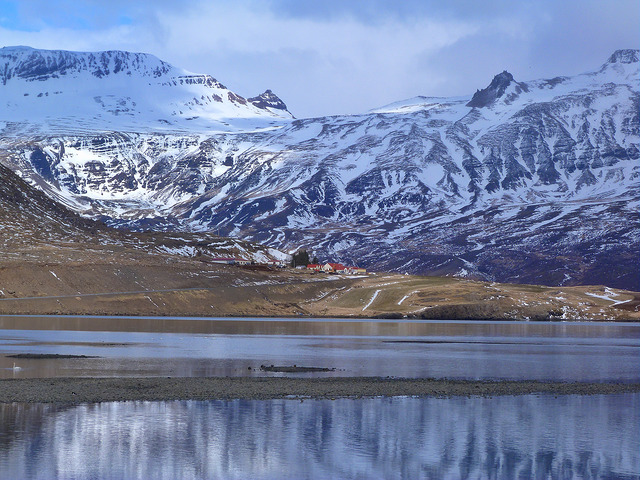

**DORMIR EN ISLANDIA**
– En Islandia tenemos desde hoteles de lujo, sobre todo en Reykjavik y poco más (o el magnífico Hotel Ranga en Hella), pasando por el hotelito con encanto bien situado, la granja (del grupo Farm Holidays, tiene un estupendo buscador), la guesthouse de un particular y el hostel. Muchos hospedajes de corte low cost incluso están para los mochileros que van con su saco de dormir y a quienes no les proporcionan ropa de cama. Por otro lado hay un buen número de campings donde en ocasiones no hay nadie para que pagues y pones el dinero en una caja (en Islandia existe la confianza en las personas, y hagamos que así siga siendo. No seamos aguilillas).
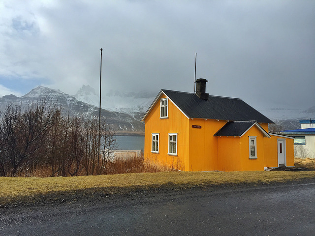

– Los hoteles en Islandia son caros y la calidad se paga mucho más que en la mayoría de países del mundo. No es raro que una habitación doble que en España correspondería a un 3 estrellas venga a costar mínimos de 200 euros en verano (fuera de temporada bajan mucho los precios). Existe la posibilidad de alojarse en granjas (Farm Holidays) que cuentan con habitaciones compartidas o privadas, a un menor coste. Y, por supuesto, de ir de un camping a otro. El mejor truco para reservar alojamiento es que definamos nuestro viaje con tiempo. La antelación siempre va a estar a nuestro favor, incluso contactar con compañías que operen en Islandia tipo la española _Island Tours_, que cuentan con ofertas especiales en hoteles que por nuestra cuenta tendrían un coste más elevado.
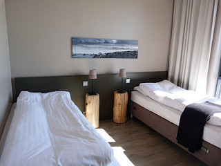

– Islandia cuenta con unas infraestructuras hoteleras bastante limitadas, sobre todo en lo que a número de camas se refiere o a capacidad para llevar a cabo excursiones o rutas. Durante la temporada alta (junio, julio, agosto y parte de septiembre o mayo) las plazas se agotan con meses de antelación y puede resultarnos especialmente complicado encontrar alojamiento. Por eso es necesario llevar a cabo las reservas de cara a no llevarnos la sorpresa de no tener dónde dormir o que el precio de ese hotel que nos gusta se haya triplicado de la noche a la mañana. En el caso de Islandia que no quepa duda que la antelación tiene premio y la improvisación se paga, sobre todo en los meses en que el país recibe a un mayor número de turistas.
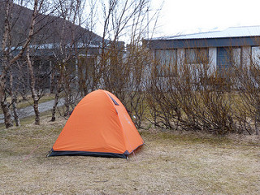

– Muchos hospedajes en Islandia son en realidad granjas con un edificio acondicionado para alojar a la gente. Son prácticamente hoteles pero se identifican de una manera diferente cuando los vemos desde la carretera. Si las indicaciones en amarillo reflejan poblaciones concretas (con el número de carretera), las granjas aparecen señalizadas con carteles azules.
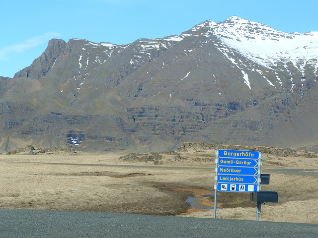

**¿ES TAN CARA ISLANDIA? ¿CAMBIO DINERO? ¿PAGO CON TARJETA?**

– La moneda utilizada en Islandia es la corona islandesa (cotización en mayo de 2016 1€=140 coronas). Para hacer la cuenta en España quienes tenemos una cierta edad es muy útil comparar el valor de las cosas con las pesetas. Si algo vale 5000 coronas es como si pagáramos 5000 pesetas de las de antes, lo que vienen siendo 30 euros. Digamos que es un truco para aprender cuanto antes las equivalencias. No es exacto pero sí aproximado.
– Islandia es de los pocos lugares del mundo donde se puede hacer un viaje de dos semanas y no tener que cambiar dinero o utilizar el cajero. Absolutamente todo, hasta las cantidades más insignificantes, se paga con tarjeta de crédito. Y cuando digo es todo es todo. Será como buscar una aguja en un pajar el caso en que no podamos abonar una cantidad determinada, aunque sea por el valor de un chicle en la tienda del pueblo más perdido de Islandia. Aun así, y por si acaso, si deseamos llevar de antemano algo de efectivo, aunque sea poco, se puede usar alguna empresa de cambio de divisas online tipo _www.globalexchange.es_ donde obtener coronas islandesas. Nunca está de más para sentirnos más tranquilos o por si da la casualidad de que el lector de tarjetas en determinado sitio está estropeado. Es raro, pero puede suceder.

– Islandia es cara lo miremos por donde lo miremos pero en nosotros está economizar lo que consideremos oportuno. Una comida/cena en restaurante o en el hotel puede costar de 50€ para arriba sin ser nada del otro mundo. Resulta más asequible comer en gasolineras donde se estila un buffet de sopas y pan que, aunque nos parezca extraño, es especialmente contundente y vienen a costar entre 6 y 10 euros. Las sopas islandesas son potentes y nos pueden dar energía (y calor) en los almuerzos. Por cierto, no dejar de probar la de champiñones. No he comido otra igual en mi vida.
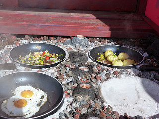

– Si nuestro presupuesto es limitado una buena manera de ahorrar está en comprar nuestra comida en la cadena de supermercados Bonus que hay en las ciudades y pueblos islandeses. Los precios no son demasiado elevados y la cuenta final del viaje se verá mucho más reducida. Además hay bastante variedad de productos. Embutidos y pan para bocadillos o sándwiches, bollería para el desayuno, fruta, el típico skyr (yogur made in Iceland) o refrescos pueden salvarnos de no esquilmar demasiado la tarjeta de crédito.

He encontrado en la red un mapa con todos los establecimientos Bonus que hay en Islandia. De ese modo puede servir a la hora de conocer dónde poder parar a hacer compra de comida, bebida, o lo que necesitemos. (Ojo, también en las gasolineras venden todo tipo de productos, aunque no tantos).
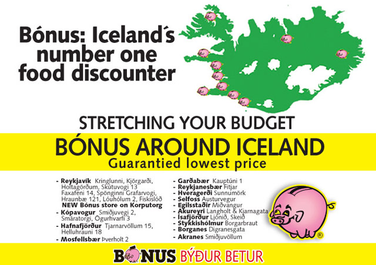

**NO TE VAYAS A ISLANDIA SIN…**
– Debemos llevar con nosotros un buen abrigo, dando igual la época del año que sea. Asimismo es aconsejable no olvidarse un cortavientos (más útil que el propio abrigo), foro polar, un gorro para cubrir la cabeza, una braga para el cuello (aunque en invierno puro los pasamontañas pueden aliviar bastante), guantes y calcetines gordos. Evitar en la medida de lo posible el algodón. En realidad el truco en Islandia es el de las capas. Como puede variar la temperatura empezamos por la mañana como una cebolla y nos vamos quitando prendas a medida haga más calor. Y viceversa.
Las gafas de sol son necesarias, tanto cuando haga sol como cuando no y vayamos a la nieve. O conduzcamos también en territorio nevado donde es fácil deslumbrarse.
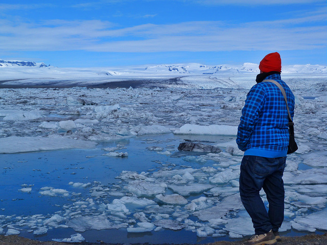

– El calzado debe ser impermeable al agua o la nieve (Gore-Tex) y, a ser posible, con buena suela para cuando vayamos a salir de caminata. Si vamos a andar por la nieve, mejor botas de caño alto para no calarnos los pies. Por si acaso, no está de más llevar dos juegos (botas y zapatillas de trekking, por ejemplo). En el caso de hacer un trekking por el glaciar harán falta crampones, pero éstos nos los proporcionarán las empresas con las que hagamos la excursión (parecido con las botas altas si vamos a hacer motos de nieve).
**AURORAS BOREALES EN ISLANDIA**
– Las auroras boreales tienen que ver con las tormentas solares y las partículas que se dejan ver en los cielos más cercanos a los polos (ya sea el Ártico o el Antártico donde se ven las luces australes). No depende, por mucho que así la gente lo crea, de si hace frío o calor. Para que tengamos posibilidad de ver auroras boreales bastan tres factores:
* Que haya tormenta solar (para eso están bien las webs de pronósticos de auroras)
* Que sea de noche. También las puede haber de día pero simplemente no las vemos porque hay luz.
* Que el cielo esté despejado. Si hay nubes mejor irnos a dormir porque las auroras, que se sepa, no tienen capacidad de atravesarlas.

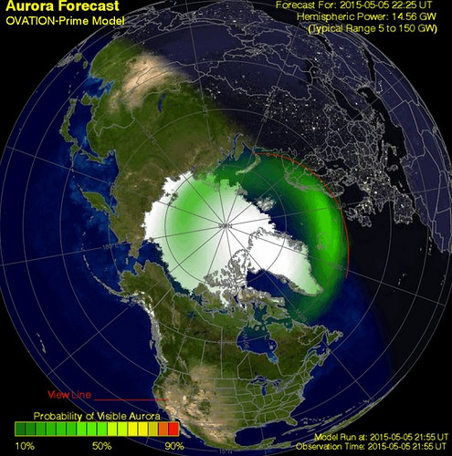

Ayuda, por supuesto, estar en una zona despejada sin contaminación lumínica, entrenar nuestra vista en la oscuridad y tener mucha pero que mucha paciencia. Conviene abrigarse bien y ser conscientes de que podemos estar horas sin ver nada y que el espectáculo surja de repente. O simplemente no surja y nos quedemos con las ganas. La naturaleza es caprichosa y no la podemos controlar.
– El mejor momento para observar las auroras boreales en Islandia lo tenemos entre noviembre y abril, aunque lo ideal está en los meses de diciembre, enero, febrero y parte de marzo. En abril la cosa se complica y a partir de mayo lo que nos falta son horas de oscuridad total.
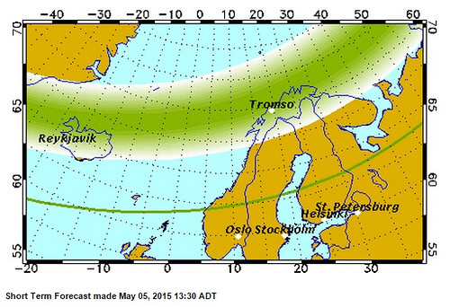

– Una buena idea para saber si tenemos probabilidad de ver auroras boreales en Islandia es mirar a partir de 48 horas de antelación la web _en.vedur.is/weather/forecasts/aurora/_, que nos informa del grado de actividad prevista y de cómo va a estar el cielo de cubierto en según qué horas de la noche. No tiene una efectividad 100% para lo bueno y para lo malo, pero funciona bastante bien. Otra web a tener en cuenta es _www.gi.alaska.edu/AuroraForecast_, aunque es más genérica. En los hoteles también pueden asesoraros si se presenta una buena noche. Incluso existe la posibilidad de que ofrezcan el servicio de avisarnos y que nos llamen a la habitación, sea la hora que sea, si está habiendo auroras en ese momento.
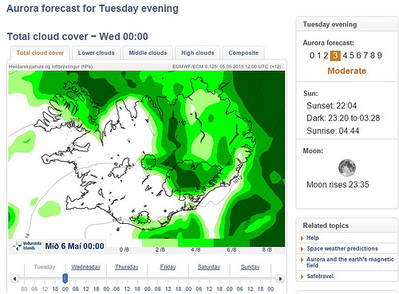

Si las luces del norte son también tu sueño no te pierdas estos _10 consejos para ver auroras boreales en el norte de Europa_. Mejor época, lugares más idóneos, trucos fotográficos y otras recomendaciones.
**DO YOU SPEAK ISLANDIC? A VUELTAS CON EL IDIOMA**
– La lengua islandesa es un tesoro de la humanidad. Apenas ha cambiado en el último milenio y un islandés podría leer con soltura un documento con muchos siglos de historia. Esto se debe, entre otras cosas, a que desde la llegada de los vikingos al país no se aceptan los neologismos venidos de otros idiomas. Si nace una nueva palabra en inglés se crea enseguida su homónima islandesa.
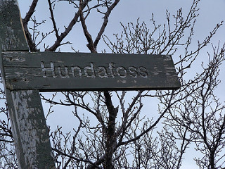

– Lo bueno que tiene el idioma islandés es que se pronuncia tal como suena, salvo varias excepciones. Y, aunque hay palabras muy largas, lo mejor es que las cortemos y las digamos despacio para que nos entiendan. ¿Recordáis el famoso volcán islandés que dejó a muchos aviones en tierra durante semanas? Sí, el Eyjafjallajökull. No es tan difícil decirlo. EYJA FJALA (la j suena como una i) JOKULL. Si lo repetís varias veces sin confundiros ya habréis dado un paso más para comunicaros con los islandeses y que os entiendan al decir ciertos nombres.
– Si nos aprendemos ciertos sufijos o palabras tendremos mucho ganado a la hora de saber de qué se trata un sitio concreto que veamos en un cartel de carretera. Por ejemplo, si un nombre termina en –jökull sabremos que se trata de un glaciar. Si lo hace en –vík una bahía. –nes designa las penínsulas y –foss a las cascadas. ¿Sabéis qué significa Reykjavík? Bahía humeante. Bahía que se encuentra en la península de Reykjanes… ¡Península humeante!
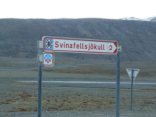

– A pesar de la dificultad del islandés, la lengua que los vikingos trajeron a la isla, la gente habla inglés con bastante fluidez. Y como en la escuela eligen otro idioma para aprender, muchos escogen el castellano. No es super raro, por tanto, encontrarse a islandeses e islandesas chapurreando un español playero infinitamente mejor al islandés que cualquiera de nosotros aprenderíamos en una década.
**JÖKULSÁRLÓN, POSTAL DE HIELO E ICONO DE ISLANDIA**
– Uno de los lugares preferidos de los viajeros que van a Islandia es la laguna glaciar Jökulsárlón, rellena de témpanos de hielo e icebergs desprendidos de una de las lenguas del gran Vatnajökull. Probablemente se trate del rincón más fotogénico del país. Es muy recomendable que pasemos una noche en el área (a no más de media hora o tres cuartos) y podamos verla tanto por la mañana como por la tarde, cuando se viven unas puestas de sola maravillosas que colorean aún más si cabe los bloques de hielo. Incluso en este segundo turno resulta más fácil ver focas salvajes asomando la cabeza.
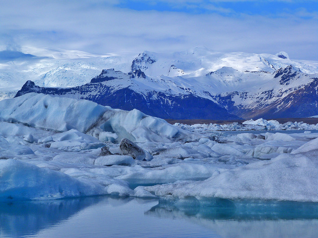

Otro consejo es que no nos centremos únicamente en el acceso que cuenta con cafetería y donde aparcan la mayoría de los coches. Si cruzamos al otro lado del puente encontraremos una mayor extensión que recorrer y diez veces menos turistas. Podremos escuchar cómo cruje el hielo y el sonido de las aves marinas que se encuentran en la zona. Además es ahí donde surge un trekking espectacular que nos acercará a otras dos lagunas glaciales en las que será difícil que nos crucemos con otro ser humano.
– A pocos kilómetros de la Laguna Jökulsárlón (en dirección Vík) hay otra laguna glacial llamada Fjallsárlón a la que va un 1% de los turistas y que nos permite disfrutar a solas de otro paraíso helado. Por supuesto es más pequeña que la primera, pero más resguardada (se llega tras adentrarnos en una carretera de grava) y el glaciar lo tenemos a una mayor cercanía. Si tenemos suerte podemos ver caer un buen bloque de hielo, ya que la pared de la lengua del glaciar queda muy a la vista. Es un lugar absolutamente encantador.
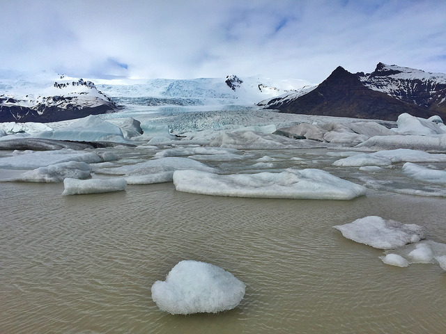

**EL PAÍS DE LAS CATARATAS**
– Islandia es el país de las cascadas. Y son tan hermosas que lo complejo es escoger cuál visitar. Si tenemos que decidir qué cataratas debemos ver sí o sí en nuestro viaje a Islandia tendríamos que anotar los siguientes nombres: Gullfoss (en el círculo dorado), Skógafoss, Svartifoss (con columnas de basalto), Seljalandsfoss (se puede pasar por detrás), Godafoss (la cascada de Dios) y Dettifoss. Particularmente me encanta además Öxarárfoss en Thingvellir.
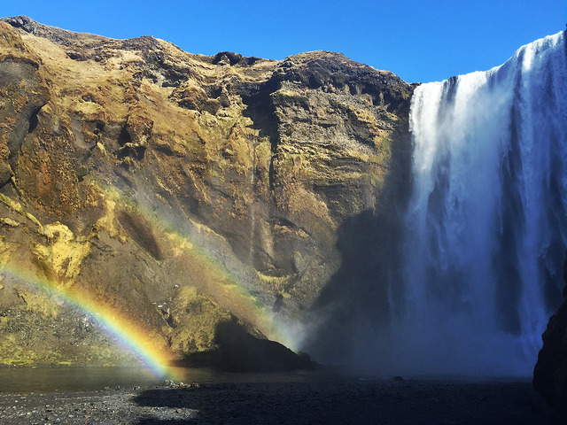

**VER FRAILECILLOS EN ISLANDIA. ¿DÓNDE ESTÁN? ¿EN QUÉ ÉPOCA VIENEN?**
– El ave nacional de Islandia es el simpático frailecillo, conocido como *puffin* en inglés. El payaso volador llega a las costas del país a finales de abril y se marcha a finales de agosto. Anida al borde de los acantilados en zonas en la que la hierba permite tener nidos mullidos que ellos mismos se ocupan de excavar y ocupar un año tras otro. El mejor momento del día para ver a esta fotogénica ave marina es durante las primeras horas de la mañana y las últimas de la tarde (en verano a partir de las 21:00) cuando regresa su acantilado tras una larga jornada de pesca en el océano (flota como una barca y se hace con sardinas o arenques aprovechando su gran pico de colores).
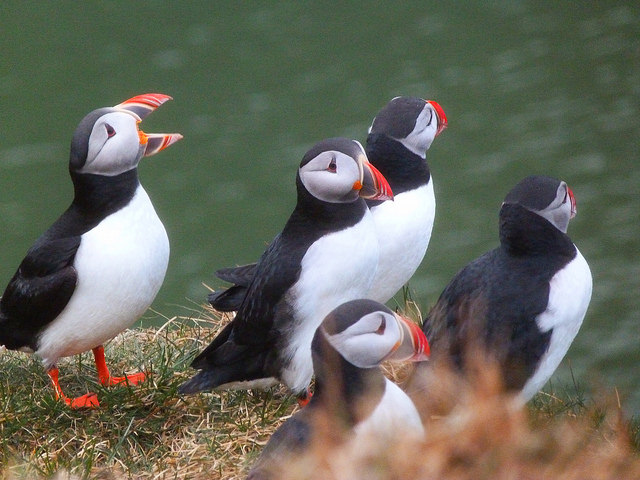

– Los mejores lugares para _ver frailecillos en Islandia_ o en cualquier lugar del Ártico son, por supuesto, los acantilados (también se dejan _ver frailecillos en las costas de Gran Bretaña_). Tendremos más posibilidad de éxito en _el promontorio de Dyrhólaey junto a Vík_ (aunque cierran el paso entre el 1 de mayo y el 25 de junio en que crían), en Látrabjarg Cliffs dentro de los fiordos occidentales. También en las islas Westman (Vestmannaeyjar) se encuentra la mayor colonia de frailecillos de toda Islandia. En Reykjavik las mismas compañías que organizan salidas para ver ballenas, tienen excursiones muy demandadas centradas en la observación de frailecillos (que, por cierto, no son pingüinos por mucho que algunos se empeñen. Lo primero porque vuelan y lo segundo porque en el hemisferio norte, salvo en _las islas Galápagos_, NO HAY PINGÜINOS).
No os perdáis este momento que pude vivir a solas con miles de frailecillos (incluye relato, fotos y vídeo) así como más información sobre los mejores lugares donde ver a estas aves: _www.elrincondesele.com/donde-ver-frailecillos-islandia-dyrholaey_

**AVISTAMIENTO DE BALLENAS EN ISLANDIA**
– Las mejores opciones para avistar ballenas en Islandia son Husavík (con un 98% de éxito en las salidas) y Reykjavík (con un 91% en temporada alta y un 60% fuera de temporada). En ambos casos se pueden observar mayoritariamente ballenas minke (las más pequeñas y las que gusta cazar a los balleneros japoneses), algunas ballenas jorobadas y, de manera excepcional, la ballena azul (el animal más grande del planeta). Incluso a veces se dejan ver orcas, aunque esto sea una lotería.
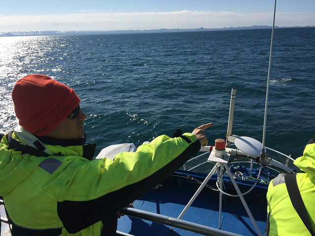

– El precio de las excursiones para observar ballenas en Islandia viene a rondar las 10.000 coronas o, lo que es lo mismo, unos 60 euros. No se garantizan salidas diarias puesto que depende del tiempo, aunque si la mar no está excesivamente brava, los barcos hacen sus rutas con normalidad. En dichos barcos proveen a los turistas de trajes para el frío y la humedad. Hay que ponérselos encima de lo que llevemos, aunque vayamos de por sí abrigados hasta los dientes. Nunca nos parecerá suficiente cuando el aire frío corta como un cuchillo, sea verano o invierno.
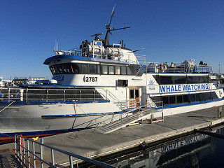

– Quienes son de mareo fácil cuando se suben a un barco deben hacerse a la idea de que también se van a marear aquí, salvo que el océano ese día sea una auténtica piscina. A veces el personal surte de pastillas para el mareo y bolsas por si acaso no somos capaces de resistir los vaivenes de la embarcación. En este caso lo mejor es tumbarse o sentarnos con la vista dirigida al horizonte lejano. Si miramos las olas nos mareamos más.
**POR SI ACASO, VIAJA SEGURO (Y CON SEGURO)**
– Cuando hagamos una excursión por zonas volcánicas con fumarolas, géiseres y pozos de agua hirviendo (algo bastante usual en Islandia) debemos ser escrupulosos con la señalización que encontremos. Bajo ningún concepto debemos salirnos de los senderos marcados porque podemos poner nuestra vida en juego si cede el suelo. Todos los años hay turistas que por pasarse de imprudentes sufren graves quemaduras. Hacer caso a las indicaciones de los parques o reservas naturales es cuestión de lógica y dos dedos de frente. Y si se va con niños, razón de más para tenerlos controlados y que no se nos escapen donde no deben.
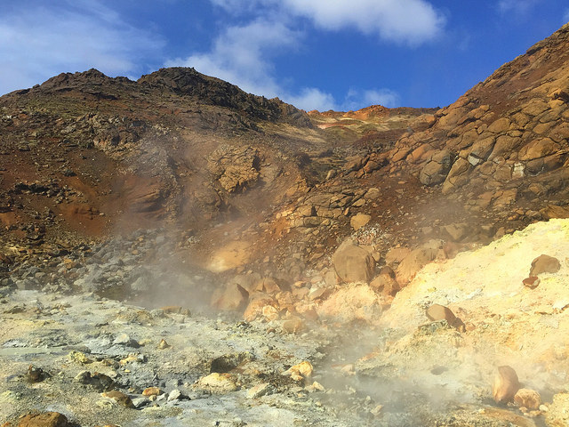

– Siempre que viajamos al extranjero conviene estar bien cubiertos por lo que pueda pasar, por lo que siempre salimos con seguro de viaje. E Islandia no es una excepción. No conviene hacer un viaje de este tipo sin **una buena póliza que nos cubra en Islandia **ante posibles accidentes, enfermedades o contratiempos que puedan suponernos un sobrecoste (la hospitalización o atención médica en este país para un extranjero es extremadamente cara). Para viajar a Islandia por tu cuenta y sin intermediarios recomendamos el seguro de viajes de IATI porque nos parece que cuenta con una cobertura superior a la media (60.000 euros), te adelantan el dinero si sucede algún problema y ofrecen un trato personalizado. Los lectores de este blog pueden _contratar el Seguro de viajes de IATI que mejor se adecué a lo que están buscando con un 5% de descuento_ (que se aplica de forma directa entrando a través este enlace).

Las agencias que montan tours organizadas o escapadas “a tu aire” como Island Tours ofrecen a sus clientes un seguro que les cubra ante posibles contratiempos. En ese caso no resulta necesario contratar un seguro aparte.
**POPURRí DE CONSEJOS PARA TENER EN CUENTA**
– En Islandia la comida tiende a ser entre las 12:00 y las 14:00 y no suele ser especialmente contundente. Las cenas, mucho más fuertes, empiezan a las 18:00 y terminan a las 20:00 o 20:30. A partir de esa hora podemos encontrarnos con que el cocinero se marche a su casa y no sirvan absolutamente nada. Hacernos cuanto antes a los horarios locales nos pondrá siempre las cosas más fáciles. Y no pondremos un aprieto al recepcionista del hotel cuando vengamos con hambre después de un día largo de actividades y no haya nada para comer.

– Los islandeses son unos auténticos entusiastas de los baños al aire libre. En un país tan frío la actividad volcánica les proporciona agua caliente casi por doquier. Por eso es raro que haya un pueblo sin su piscina municipal al aire libre y una cantidad ingente de baños naturales nos colapsen de propuestas apetecibles para relajarnos como cuando los vikingos venían de la batalla.
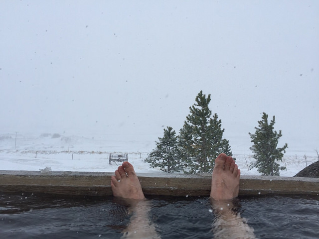

El baño más famoso de todo Islandia es el Blue Lagoon con su inconfundible azul y unas instalaciones magníficas, aunque también sea el más caro (mínimo del paquete básico 35€, y sube por momentos). Por mucho menos dinero tendremos múltiples posibilidades de darnos un baño delicioso con vistas mientras vemos caer la nieve. Incluso muchos hoteles, granjas o guesthouses cuentan con sus propios hot pots, que son una especie de jacuzzis o mini-piscinas donde meternos al agua por la noche a ver las estrellas (o las auroras) mientras en el exterior estamos a bajo cero.
– El Blue Lagoon, como he comentado, tiene las mejores instalaciones y es uno de los iconos de Islandia en cuanto a baños se refiere. Puja con él el Myvatn Natural Bath el el norte, bastante más barato, y en un entorno sobrenatural. Pero también es cierto que cuando un lugar es famoso, lo es por algo, así que sí recomiendo darse el capricho del Blue Lagoon nada más empezar el viaje. O incluso diría que mucho mejor al terminarlo. Se encuentra próximo al aeropuerto de Keflavik (20 kilómetros o 15 minutos) y puede ser una forma magnífica (y relajante) de despedirnos de nuestro viaje a Islandia.
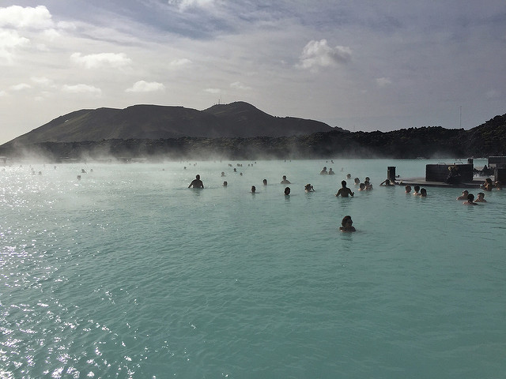

– Para los que les guste salir de marcha Islandia no es el mejor país del mundo para hacerlo. Con una salvedad y muy positiva en este sentido llamada Reykjavík. A pesar de ser una ciudad pequeña y tranquila, se vuelve loca por las noches. Cuenta con un elevado número de locales nocturnos que funcionan durante toda la semana. Cuando llega el viernes, además, comienza el runtur, en que la juventud no sólo sale de marcha. Se pone a dar vueltas con el coche para ligar. Así como suena. Es realmente curioso. Así que ya sabéis, si buscáis fiesta Reykjavik es el lugar. Durante el camino lo más marchoso que veremos será el vuelo atropellado de los frailecillos.
– Hay internet gratis en prácticamente el 100% de los alojamientos islandeses. Está muy extendido el wifi, que llega a las gasolineras más remotas, a los restaurantes, cafés y muchos lugares públicos. En cuanto a cobertura 3G por quien lleve un móvil con SIM islandesa o un router portátil, decir que en la mayor parte de Islandia hay una pésima señal para conectarse a internet en el camino (que no para llamar, que sí hay).
 

– La corriente eléctrica en Islandia es como en España, de 220 voltios, y los enchufes también son los mismos. Las habitaciones de hoteles suelen tener varias tomas para poder cargar móviles, ordenadores, cámaras, etc. Puede ser más complicado en los campings y, por supuesto, cuando estemos haciendo un trekking en un parque natural. Es muy recomendable llevar cargadores para el coche (de esos que se ponen en el mechero) y, por supuesto, baterías externas para cuando nuestros dispositivos electrónicos estén en la reserva.
– Si se viaja en verano a Islandia debemos saber que no se hace nunca de noche. Y como las persianas no van con ellos entra luz por mucho que tapes las ventanas con una cortina. Llevarse un antifaz que nos cubra los ojos cuando nos acostemos nos ayudará, y mucho, a conciliar el sueño y no despertarnos a deshora.
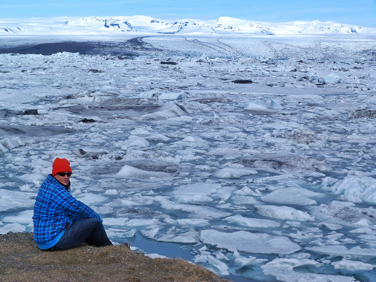

– Dado que en Islandia no requieren de calentadores, porque el agua viene caliente del subsuelo, es usual que de la ducha salga un cierto tufillo a azufre. No debemos preocuparnos por semejante aroma sulfuroso porque no se nos queda en la piel ni iremos oliendo a azufre como el Diablo. Por otro lado el agua fría que sale de los grifos es absolutamente potable y podemos beber de ella con toda la tranquilidad.
**Y EL CONSEJO MÁS IMPORTANTE DE TODOS…**

– Sé que llevamos ya 50 consejos, pero no puedo dejarme lo más importante. Disfrutar Islandia, no sólo de su belleza sino del aprendizaje ante los 

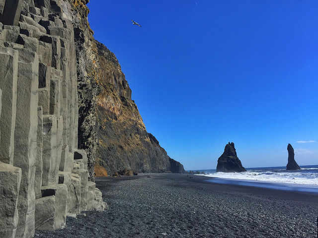

contratiempos que surgirán. Debo insistir en que un viaje a Islandia no siempre es lo idílico que uno pueda pensar, sobre todo cuando estamos a merced de la climatología y un día se puede poner a nevar a lo bestia o un volcán entrar en erupción de forma repentina (no es algo raro precisamente). No pasa nada. Islandia lleva la palabra VIAJE escrita en su piel de lava. Y ya sabemos que un viaje es como la vida, tiene altibajos, momentos buenos y otros no tan buenos que debemos saber sobrellevar y sacarle el mejor partido posible. De ese modo viajar a Islandia será una experiencia íntegra que nos ayude a conocer de verdad un país maravilloso de gente amable y rincones que por mucho que nos los hayan contado nos van a emocionar. Si pretendemos un viaje perfecto y relajado, yo no elegiría Islandia. Si, en cambio, deseamos vivir un viaje que nos marque para siempre y se lo queramos contar a nuestros nietos con verdadera pasión, Islandia es lo que estamos buscando. Nunca nos defraudará. Palabra de viajero…

