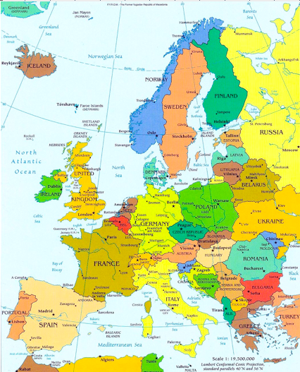
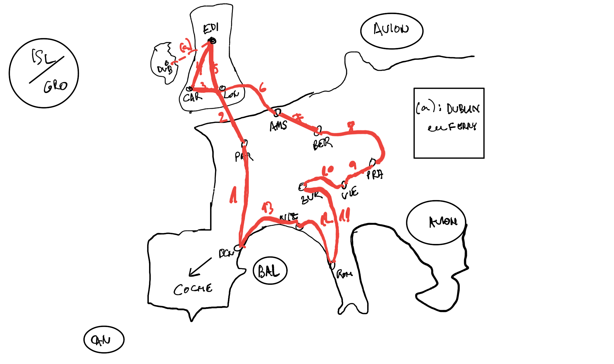

# Viajes a Europa

**España (Coche/Avión para islas)**

España/Portugal: País Vasco, Fachada norte, Andalucía, Algarve, Lisboa

Formigal, Panticosa, Cerler, Astún, Candanchú

Baqueira, Boi Taüll

Mallorca, Ibiza, Menorca

Tenerife, Lanzarote, Gran Canaria, Fuerteventura (Club La Santa)

Galáctica Teruel

Paradores

Camino de Santiago
Ruta N-340
Cabo de Gata
Tarifa

_http://www.skyscanner.es/noticias/las-10-mejores-piscinas-naturales-de-espana_

_http://www.skyscanner.es/noticias/los-17-rincones-mas-bonitos-de-las-islas-baleares__
_
_
_
Tarifa
Restaurantes: Surla, Power House, Raizes o La Garrocha
Tomar algo: Punta Paloma o las Dunas
Playa: Los Lances

Lugares de España que se parecen a otros lugares famosos
Lejano Oeste-Desierto de Tabernas
Teatro de Palmira-Teatro de Mérida
Tirol-Picos de Europa
Hawaii-Canarias
Islas Jónicas-Islas Baleares
Chefchaouen-Júzcar
Basílica de Guadalupe-Catedral De Santiago
Copenhague-Villajoyosa
Manarola (Cinque Terre)-Cudillero
Toscana-La Rioja
Cancún-La Manga
Alpes-Pirineos
Santiago de Chile-Madrid
La Plata-Barcelona
Maldivas-Playa de Seiruga (A Coruña)
Riviera Nayarit-Playa de Gulpiyuri
Carcasona-Olite
Acantilados de Irlanda-Acantilados de Galicia
Catedral de Colonia-Catedral de Burgos
Fiordos noruegos-Riaño
Cerezos de Japón-Valle del Jerte
Catedral de San Basilio-Sagrada Familia

**Europa occidental (Interrail)**

La ruta de Bourne (interrail): Barcelona-París-Amsterdam-Berlin-Praga-Viena-Zurich-Roma

Francia: París, Zona Alpes, Costa Azul, Biarritz

_Top Ten Things to Do in Paris, France_

_https://www.tripadvisor.es/Attraction_Review-g660465-d6854161-Reviews-Mont_St_Clair-Sete_Herault_Occitanie.html_

Italia: Roma, Zona Alpes, Malta, Toscana

Suiza: Zona Alpes, Ginebra, Zurich

Holanda: Amsterdam

Alemania: Berlín

Rep.Checa: Praga

Austria: Viena

Reino Unido: Cardiff, Glasgow, Dublin, Londres, Edimburgo

_London on a Budget: 47 Free and Cheap Things To Do_

**Italia**

Chianti
Terme di Saturnia
Isole d’Elba

F1 Imola
_https://www.visitmodena.it/en/discover-modena/itineraries-and-routes/discovering-the-motor-valley_

 
Alquiler Ferrari en Maranello
Maserati Factory Tour
Museo Lamborghini - Bolonia _https://www.museolamborghini.com/en/opening-fees/_

Museo Ducati - Bolonia _https://tickets.ducati.com/en/event/ingresso-museo/155561_

Franceschetta 58 Modena 

Lago di Garda
Lago di Como
 
Cerdeña
Sicilia, Corleone, Etna, Agrigento
Capri
Isla de Procida, Positano
Nápoles, Herculano, Pompeya
 
Roma
 
Florencia
Pisa
Siena
Milán
Turín
Venecia
Verona

**Francia**

 
Córcega
Normandía
Biarritz
 
París
Castillos del Loira
Le-Puy-en-Velay
Annecy
Carcassone
Mont-Saint-Michel

**Europa oriental**

Eslovenia, Croacia

Grecia: Atenas, Santorini

Turquía: Estambul

**Europa nórdica**

Cabo Norte

Dinamarca: Copenhagen

Suecia: Estocolmo

Noruega: Oslo, Bergen, Cabo Norte

Finlandia: Helsinki
Estonia

_https://www.visitnorway.es_

_https://www.rallytravel.com/?page=tour-escorted&idno=31_

**Europa lejana**

Islandia: Reykjavik

Groenlandia

